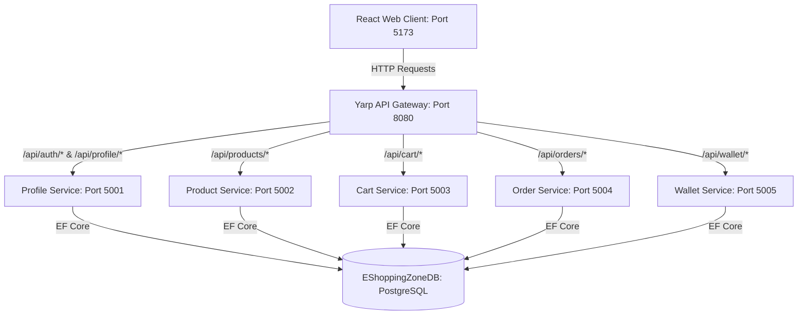
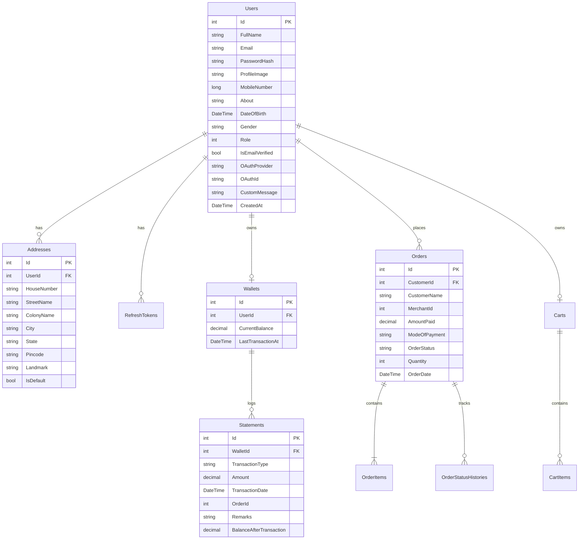

# TECHNICAL SPECIFICATION & REFERENCE MANUAL
## EShoppingZone Microservices E-Commerce Platform

---

## 1. System Architecture & Topology

EShoppingZone is a modern, high-performance, container-ready e-commerce platform built using a distributed **Microservices Architecture** on the backend and a component-based **Single Page Application (SPA)** on the frontend.



### 1.1. API Gateway Routing Topology
The backend utilizes **Yarp (Yet Another Reverse Proxy)** in the `EShoppingZone.Gateway` project as a centralized entry point. It handles token verification passing, CORS management, and reverse proxies requests to separate microservice clusters:

| Route Path | Targeted Cluster | Backend Port | Responsible Controller Actions |
| :--- | :--- | :--- | :--- |
| `/api/auth/{**catch-all}` | `profile-cluster` | `http://localhost:5001` | User Login, Registration, Password Recovery, Token Refresh |
| `/api/profile/{**catch-all}` | `profile-cluster` | `http://localhost:5001` | Retrieve profile, update profile, address management, custom message updates |
| `/api/admin/{**catch-all}` | `profile-cluster` | `http://localhost:5001` | System stats, user administration, system-wide transaction reports |
| `/api/products/{**catch-all}` | `product-cluster` | `http://localhost:5002` | Catalog access, merchant listings, stock adjustments, filtering |
| `/api/cart/{**catch-all}` | `cart-cluster` | `http://localhost:5003` | Add/Remove products, quantity updates, total calculation |
| `/api/orders/{**catch-all}` | `order-cluster` | `http://localhost:5004` | Order placement, cancellation, history queries, agent assignments |
| `/api/wallet/{**catch-all}` | `wallet-cluster` | `http://localhost:5005` | Card deposits, debit/credit transactions, financial ledger reporting |

### 1.2. Service Architecture (Clean Architecture Pattern)
Each microservice is structured following **Domain-Driven Design (DDD)** and **Clean Architecture** principles to separate concerns and guarantee testability:
1. **Domain Layer**: Contains database entities, value objects, and repository contracts (`IUserRepository`, etc.). It has zero external dependencies.
2. **Application Layer**: Contains business logic, DTO definitions, validations, and service contracts (`IProfileService`, etc.).
3. **Infrastructure Layer**: Handles external frameworks, Entity Framework Core `DbContext`, data migrations, and physical repository implementations (`UserRepository.cs`).
4. **API Layer**: Controller endpoints exposing HTTP actions, routing, middleware (like `GlobalExceptionMiddleware`), and program startup (`Program.cs`).

---

## 2. Database Schema & Entity Relationship Model

All microservices write to an integrated PostgreSQL database (`EShoppingZoneDB`). Below is the complete logical schema definition showing entities, attributes, primary/foreign key mappings, and database constraints.



### 2.1. Detailed Database Table Definitions

#### `Users` Table
Exhaustive schema details for user identities:
* **`Id`** (`INT`, PK, Auto-Increment): Unique identity of the user.
* **`FullName`** (`VARCHAR(200)`, Required): Full legal name of the user.
* **`Email`** (`VARCHAR(200)`, Unique, Index, Required): Contact email, used as login username.
* **`PasswordHash`** (`VARCHAR(500)`, Nullable): BCrypt hashed password for password-based login.
* **`ProfileImage`** (`VARCHAR(2000)`, Nullable): URL string pointing to the profile picture (S3 or Google account URL).
* **`MobileNumber`** (`BIGINT`, Index): 10-digit mobile contact number.
* **`About`** (`VARCHAR(2000)`, Nullable): User bio/profile remarks.
* **`DateOfBirth`** (`TIMESTAMP`, Nullable): Birthdate.
* **`Gender`** (`VARCHAR(20)`, Nullable): Gender description ("Male", "Female", "Other").
* **`Role`** (`INT`, Index, Required): Role Enum value (`1` = Customer, `2` = Merchant, `3` = Admin, `4` = DeliveryAgent).
* **`IsEmailVerified`** (`BOOLEAN`, Defaults to `false`): Verification status flag.
* **`OAuthProvider`** (`VARCHAR(100)`, Nullable): Authentication provider (e.g. `"Google"`).
* **`OAuthId`** (`VARCHAR(200)`, Nullable): External login ID from third-party OAuth provider.
* **`CustomMessage`** (`VARCHAR(200)`, Nullable): **[NEW]** Demonstration column for interviewer test button, defaults to null.
* **`CreatedAt`** (`TIMESTAMP`, Required): Row creation timestamp.
* **`IsActive`** (`BOOLEAN`, Required): Soft-delete flag.

#### `Addresses` Table
Stores user shipping and contact addresses:
* **`Id`** (`INT`, PK, Auto-Increment): Address unique ID.
* **`UserId`** (`INT`, FK to `Users.Id`, Cascade Delete): Identifies who owns the address.
* **`HouseNumber`** (`VARCHAR(50)`, Required): Flat/House number snapshot.
* **`StreetName`** (`VARCHAR(200)`, Required): Road or street name.
* **`ColonyName`** (`VARCHAR(200)`, Nullable): Neighborhood identifier.
* **`City`** (`VARCHAR(100)`, Required): City name.
* **`State`** (`VARCHAR(100)`, Required): State/Province name.
* **`Pincode`** (`VARCHAR(10)`, Required): Postal/Zip code.
* **`Landmark`** (`VARCHAR(200)`, Nullable): Navigation landmark.
* **`IsDefault`** (`BOOLEAN`, Required): Indicates if it's the primary shipping destination.

#### `Wallets` Table
Financial account for customers and merchants:
* **`Id`** (`INT`, PK, Auto-Increment): Unique wallet serial key.
* **`UserId`** (`INT`, Unique, FK to `Users.Id`): Owner of the wallet.
* **`CurrentBalance`** (`DECIMAL(18,2)`, Required): Funds balance. Must be non-negative.
* **`LastTransactionAt`** (`TIMESTAMP`, Nullable): Date of last Statement generation.

#### `Statements` Table
Double-entry ledger logging all credit/debit activity:
* **`Id`** (`INT`, PK, Auto-Increment): Transaction reference key.
* **`WalletId`** (`INT`, FK to `Wallets.Id`): Targeted wallet.
* **`TransactionType`** (`VARCHAR(10)`, Required): Operation type (`"CREDIT"` or `"DEBIT"`).
* **`Amount`** (`DECIMAL(18,2)`, Required): Absolute value of transaction.
* **`TransactionDate`** (`TIMESTAMP`, Required): Execution time.
* **`OrderId`** (`INT`, Nullable): Foreign reference to `Orders` table if transaction represents an order checkout.
* **`TransactionRemarks`** (`VARCHAR(500)`, Required): Ledger comments (e.g. `"Cart Checkout Order #3"`, `"Deposit via Card"`).
* **`BalanceAfterTransaction`** (`DECIMAL(18,2)`, Required): Post-transaction balance snapshot for validation audits.

#### `Products` Table
Inventory items catalog:
* **`Id`** (`INT`, PK, Auto-Increment): Product reference key.
* **`ProductName`** (`VARCHAR(200)`, Required): Public catalog title.
* **`ProductType`** (`VARCHAR(100)`, Required): Broad product filter category.
* **`Category`** (`VARCHAR(100)`, Required): Sub-catalog category tag (e.g. `"Electronics"`).
* **`Price`** (`DECIMAL(18,2)`, Required): Listing unit price.
* **`Description`** (`TEXT`): Rich text product listing description.
* **`StockQuantity`** (`INT`, Required): Quantity in inventory.
* **`Ratings`** (`JSONB`): Key-value pair of user rating counts (1 to 5 stars).
* **`Images`** (`JSONB`): Array of image URL strings.
* **`Specifications`** (`JSONB`): Key-value dictionary of tech specs (e.g., `{"RAM": "16GB", "Storage": "512GB"}`).
* **`MerchantId`** (`INT`, FK to `Users.Id`): Reference identifying the seller.

#### `Orders` Table
Checkout orders summary:
* **`Id`** (`INT`, PK, Auto-Increment): Public order reference key.
* **`OrderDate`** (`TIMESTAMP`, Required): Date of order submittal.
* **`CustomerId`** (`INT`, FK to `Users.Id`): Customer making purchase.
* **`CustomerName`** (`VARCHAR(200)`): Snapshot name of user at checkout.
* **`MerchantId`** (`INT`): Reference ID of the product seller.
* **`AmountPaid`** (`DECIMAL(18,2)`, Required): Total payment amount.
* **`ModeOfPayment`** (`VARCHAR(50)`): Method (`"Wallet"` or `"Card"`).
* **`OrderStatus`** (`VARCHAR(50)`): State (`"Placed"`, `"Shipped"`, `"Delivered"`, `"Cancelled"`).
* **`Quantity`** (`INT`): Aggregate number of items.
* **`DeliveryAgentId`** (`INT`, Nullable): FK to `Users.Id` representing delivery courier.

---

## 3. Frontend Architecture & Navigation Model

The frontend is a fast **React 18** SPA compiled with **Vite** and configured with client-side routing via `react-router-dom`. 

### 3.1. Authentication & Route Guards
The client uses a token-based authentication context (`AuthContext.jsx`) which keeps user session state. High-security administrative areas are wrapped within `ProtectedRoute` components:

```jsx
// Route Guard Flow
if (!isAuthenticated) return <Navigate to="/login" />
if (!allowedRoles.includes(user.role)) return <Navigate to="/" replace />
return children;
```

### 3.2. Detailed Screen Reference & Button Actions

Here is an exhaustive detailing of every user interface page, including input elements, action buttons, and their operational definitions:

#### A. Home Page (`HomePage.jsx`)
The default storefront landing page displaying banner highlights and categories.
1. **"Explore Collection" Button**
   * *UI Class:* `btn-add-to-cart hero-btn`
   * *Action:* Scroll to the bottom products catalogue section smoothly.
   * *API Triggered:* None (client scroll effect).
2. **"Our Story" Button**
   * *UI Class:* `btn-view-details hero-btn`
   * *Action:* Opens modal window displaying e-commerce history (`OurStoryModal.jsx`).
   * *API Triggered:* None.
3. **"Clickable" Button (Interviewer Demo Button)**
   * *UI Class:* `btn-view-details hero-btn`
   * *Action:* Hits the API Gateway to update the current user's profile database row, writing `"hi"` into the newly created `CustomMessage` column.
   * *API Triggered:* `PATCH /api/profile/custom-message` with JSON `{ "message": "hi" }`. On success, alerts `Success! 'hi' has been successfully written to the database for this user.`
4. **"Category Chips" (All, Electronics, Apparel, etc.)**
   * *UI Class:* `category-chip`
   * *Action:* Filters product list by category. Resets pagination index.
   * *API Triggered:* `GET /api/products?page=1&pageSize=12&category={selected}`.
5. **"Pagination Arrows" (‹ and ›)**
   * *UI Class:* `pagination-btn`
   * *Action:* Shifts catalog pages forward or backward.
   * *API Triggered:* `GET /api/products?page={currentIndex}&pageSize=12`.

#### B. Shop/Filter Page (`Shop.jsx`)
Grid view for search, category filter, and sorting.
1. **"Search Bar Input"**
   * *Action:* Filters catalogue text match.
   * *API Triggered:* `GET /api/products?search={term}`.
2. **"Sort Selector Dropdown"**
   * *Action:* Reorders products by "price-low-to-high", "price-high-to-low", or "newest".
   * *API Triggered:* `GET /api/products?sortBy={value}`.
3. **"Product Card Clicks"**
   * *Action:* Redirects client route to details page of targeted ID.
   * *API Triggered:* Client routing redirect to `/products/{id}`.

#### C. Product Details Page (`ProductDetail.jsx`)
Full-page presentation of a single product's metadata, images, and reviews.
1. **"Add to Cart" Button**
   * *UI Class:* `btn-add-to-cart`
   * *Action:* Adds item to shopping cart state and saves it in the database.
   * *API Triggered:* `POST /api/cart/add` with JSON `{ "productId": x, "quantity": 1 }`.
2. **"Buy Now" Button**
   * *UI Class:* `btn-buy-now`
   * *Action:* Adds item directly to cart, bypassing summary review, and redirects routes directly to Checkout.
   * *API Triggered:* `POST /api/cart/add` followed by navigation redirect to `/checkout`.
3. **"Back to Shop" Button**
   * *Action:* Returns client route to `/shop`.
   * *API Triggered:* Client routing back-step.

#### D. Shopping Cart Page (`Cart.jsx`)
Displays a summary of items added for purchase.
1. **"Quantity Increment / Decrement" (+ and -)**
   * *Action:* Modifies target cart item count.
   * *API Triggered:* `PUT /api/cart/item` with new quantity value.
2. **"Remove Item" Button**
   * *Action:* Deletes product from shopping cart.
   * *API Triggered:* `DELETE /api/cart/item/{productId}`.
3. **"Proceed to Checkout" Button**
   * *Action:* Verifies inventory and navigates to the payment gateway page.
   * *API Triggered:* Client routing redirect to `/checkout`.

#### E. Checkout Page (`Checkout.jsx`)
Review shipping destination details, payment methods, and finalize checkout.
1. **"Address Radio Selector"**
   * *Action:* Chooses shipping target from user's address registry.
   * *API Triggered:* None (local page state update).
2. **"New Address Form Submission"**
   * *Action:* Saves a new location onto user profile records.
   * *API Triggered:* `POST /api/profile/address` with address metadata inputs.
3. **"Place Order via Wallet" Button**
   * *Action:* Debits checkout price from wallet account balance, registers the purchase records in Order Service, clears customer shopping cart, and creates order records.
   * *API Triggered:* 
     1. `POST /api/wallet/debit` with JSON `{ "amount": total, "remarks": "Checkout Order" }`
     2. `POST /api/orders` with cart items and address snapshot payload.
     3. `DELETE /api/cart/clear` to clean customer cart.
     4. Navigation to `/customer/orders` on checkout completion.

#### F. Wallet Page (`Wallet.jsx`)
Customer ledger summary for fund deposits and tracking balance.
1. **"Add Funds Input field & Deposit" Button**
   * *Action:* Simulates credit card deposit transaction to add balance to wallet.
   * *API Triggered:* `POST /api/wallet/credit` with deposit balance decimal value.
2. **"Statement Date Filter" Dropdown**
   * *Action:* Queries ledger entries by timestamp.
   * *API Triggered:* `GET /api/wallet/statements`.

#### G. Profile Management Page (`Profile.jsx`)
Edit user name, biological info, contact numbers, upload profile photos, and register locations.
1. **"Save Profile Changes" Button**
   * *Action:* Updates text information.
   * *API Triggered:* `PUT /api/profile/update` with changed fields.
2. **"Profile Image Input Clicks"**
   * *Action:* Submits image link/file references.
   * *API Triggered:* `POST /api/profile/upload-image`.
3. **"Delete Image" Icon**
   * *Action:* Clears user avatar and restores default placeholder icon.
   * *API Triggered:* `DELETE /api/profile/image`.
4. **"Delete Address" Button**
   * *Action:* Removes designated location from address grid.
   * *API Triggered:* `DELETE /api/profile/address/{addressId}`.
5. **"Set Default Address" Star/Badge**
   * *Action:* Designates location as default checkout destination.
   * *API Triggered:* `PATCH /api/profile/address/{addressId}/default`.

#### H. Admin Dashboard Page (`AdminDashboard.jsx`)
High-level overview for site administrators to track platform performance.
1. **"User Management Rows & Role Selectors"**
   * *Action:* Alters privileges of logged user IDs.
   * *API Triggered:* `PUT /api/admin/user-role` with targets.

#### I. Merchant Dashboard Page (`MerchantDashboard.jsx`)
Listing management panel for sellers.
1. **"Upload Product" Button & Form**
   * *Action:* Creates new listing catalog row.
   * *API Triggered:* `POST /api/products` with specification JSON, prices, stock levels, and name.
2. **"Adjust Stock Input & Save" Button**
   * *Action:* Updates listing quantities.
   * *API Triggered:* `PUT /api/products/{id}/stock`.

---

## 4. Key Platform Workflows (UML Sequence Reference)

Here are the end-to-end UML communication flowcharts depicting key operations of the platform.

### 4.1. Sign-Up & Security Login Flow
How authentication is processed, keys generated, and session states synchronized across front/back layers.

```mermaid
sequenceDiagram
    autonumber
    actor Client as Client App (React)
    participant Gateway as API Gateway (Yarp)
    participant Auth as Auth Service (Profile.API)
    database Postgres as PostgreSQL DB

    Client->>Gateway: POST /api/auth/login {Email, Password}
    Gateway->>Auth: Route request
    Auth->>Postgres: SELECT * FROM Users WHERE Email = input
    Postgres-->>Auth: User records (Password Hash)
    Auth->>Auth: Verify Bcrypt(Password, Hash)
    
    alt Verification Success
        Auth->>Postgres: Create Refresh Token Record
        Postgres-->>Auth: Saved success
        Auth->>Auth: Generate JWT (Role, ID, FullName)
        Auth-->>Gateway: 200 OK {JWT, RefreshToken, UserDTO}
        Gateway-->>Client: 200 OK {JWT, RefreshToken, UserDTO}
        Client->>Client: Save JWT in localStorage; Update AuthContext
    else Verification Failed
        Auth-->>Gateway: 401 Unauthorized {ErrorMsg}
        Gateway-->>Client: 401 Unauthorized {ErrorMsg}
    end
```

### 4.2. Checkout & Wallet Ledger Payment Transaction
Transaction processing ensuring financial security, inventory adjustments, and checkout finalization.

```mermaid
sequenceDiagram
    autonumber
    actor Client as Customer (React Client)
    participant Wallet as Wallet Service
    participant Order as Order Service
    participant Cart as Cart Service
    database DB as PostgreSQL DB

    Client->>Wallet: POST /api/wallet/debit {Amount: $X}
    Note over Wallet, DB: Transaction check & balance validation
    Wallet->>DB: UPDATE Wallets SET Balance = Balance - X WHERE UserId = Current
    DB-->>Wallet: Row updated
    Wallet->>DB: INSERT INTO Statements (Debit, BalanceAfter)
    DB-->>Wallet: Ledger logged
    Wallet-->>Client: 200 OK {Success: true}

    Client->>Order: POST /api/orders {CartItems, AddressSnapshot}
    Order->>DB: INSERT INTO Orders, OrderItems, OrderStatusHistory
    DB-->>Order: Saved success
    Order-->>Client: 200 OK {OrderId: Y}

    Client->>Cart: DELETE /api/cart/clear
    Cart->>DB: DELETE FROM CartItems WHERE CartId = CurrentCart
    DB-->>Cart: Cleared
    Cart-->>Client: 200 OK (Cart empty)
```

### 4.3. Interviewer "Clickable" DB Update Flow
Demonstrates the database update workflow triggered by the newly added button.

```mermaid
sequenceDiagram
    autonumber
    actor Client as Customer/Interviewer (React)
    participant Gateway as API Gateway
    participant Profile as Profile Service
    database DB as PostgreSQL DB

    Client->>Client: Clicks "Clickable" Hero Button
    Client->>Gateway: PATCH /api/profile/custom-message { message: "hi" }
    Gateway->>Profile: Route request (validates JWT)
    Profile->>DB: SELECT * FROM Users WHERE Id = ClaimUserID
    DB-->>Profile: User entity record
    Profile->>Profile: Update entity property CustomMessage = "hi"
    Profile->>DB: UPDATE Users SET CustomMessage = "hi" WHERE Id = UserID
    DB-->>Profile: Column updated successfully
    Profile-->>Gateway: 200 OK { UpdatedProfileDTO }
    Gateway-->>Client: 200 OK { UpdatedProfileDTO }
    Client->>Client: Alert "Success! 'hi' written to DB"
```

---

## 5. Development & Deployment Procedures

### 5.1. Database Migration Setup
To expand the DB table columns, execute the following from the C# target directories:
1. **Migration Generation:**
   ```powershell
   cd C:\Sprint\backend\services\profile-service\src\EShoppingZone.Profile.Infrastructure
   dotnet ef migrations add AddCustomMessageToUser --startup-project ..\EShoppingZone.Profile.API\EShoppingZone.Profile.API.csproj
   ```
2. **Apply migration to local PostgreSQL instance:**
   ```powershell
   dotnet ef database update --startup-project ..\EShoppingZone.Profile.API\EShoppingZone.Profile.API.csproj
   ```

### 5.2. Running Backend Microservices Locally
To launch services, you can run `dotnet run` inside their API startup directories or run the central solution file:
* **API Gateway Port:** `http://localhost:8080`
* **React Web Port:** `http://localhost:5173` (Vite) / `http://localhost:3000` (development server)
* Environment API variables must point to `VITE_API_BASE_URL=http://localhost:8080`.
