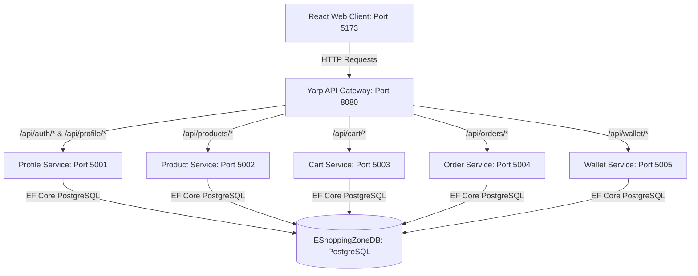
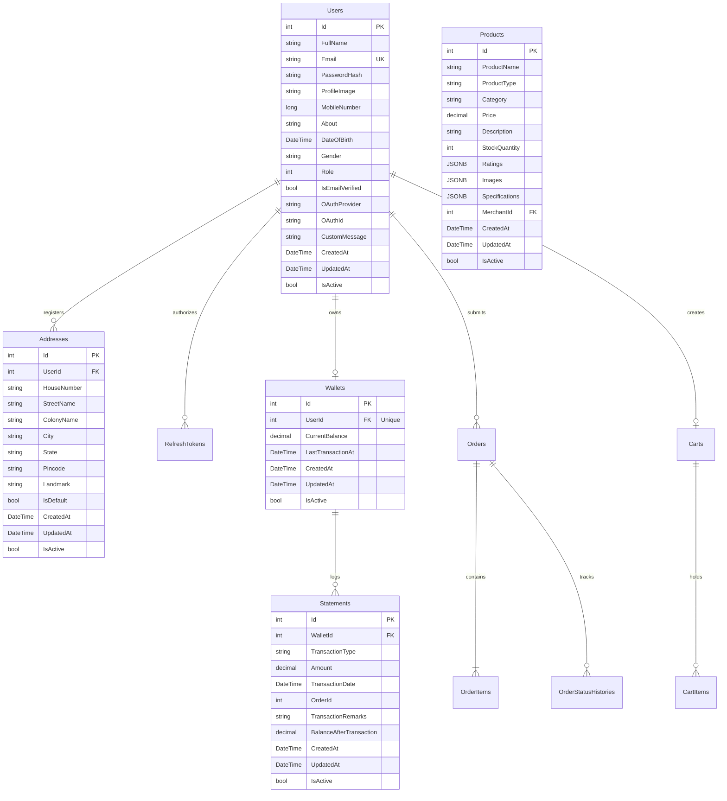
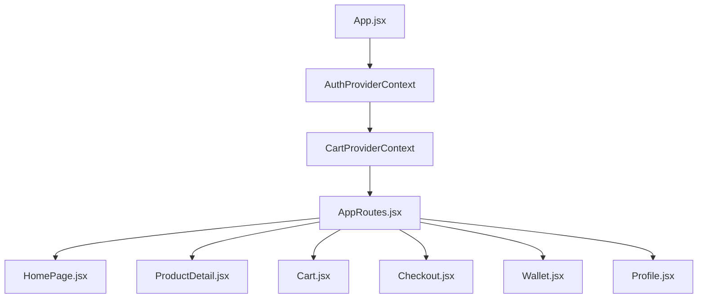
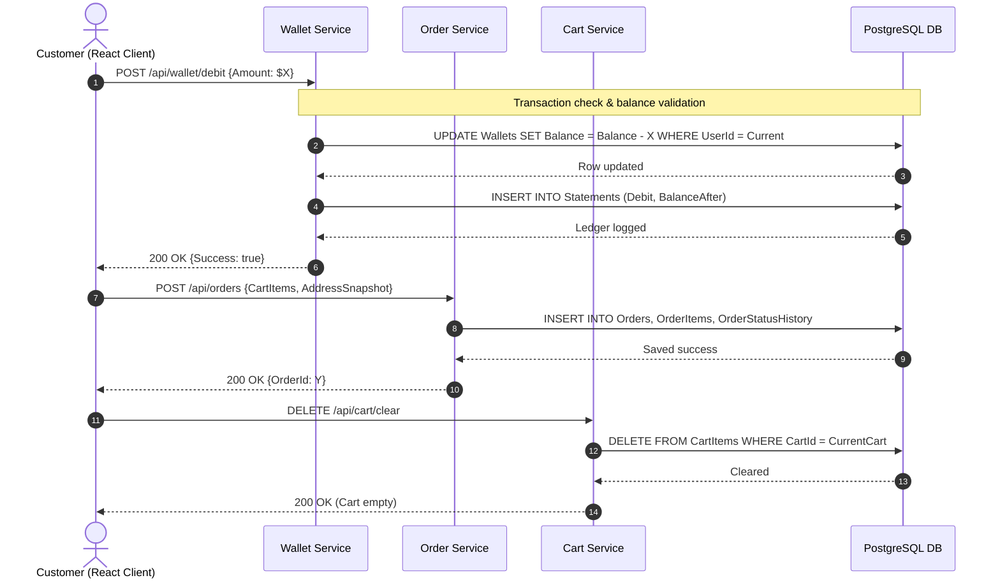
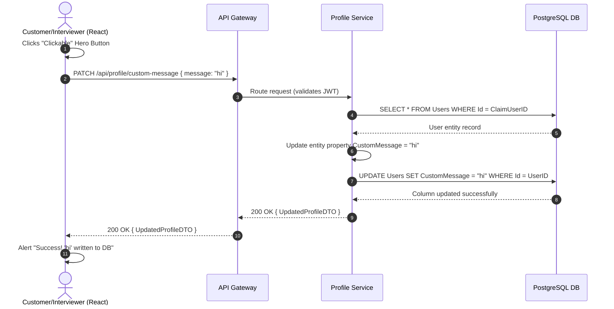

# ENTERPRISE TECHNICAL SPECIFICATION & REFERENCE MANUAL
## EShoppingZone Microservices E-Commerce Platform

---

## 1. Executive Summary & Core Architectural Principles

EShoppingZone is a high-availability, distributed, enterprise e-commerce platform. It is engineered to deliver high performance, modular maintainability, and horizontal scalability. The system utilizes a **decoupled microservices topology** on the backend and a highly responsive, modern **Single Page Application (SPA)** on the frontend.



### 1.1. Core Architectural Pillars
* **Decoupled Microservices**: Services are split into independent domain boundaries (Profile/Auth, Products, Cart, Order, and Wallet). Each manages its own schemas and isolates database operations.
* **Centralized API Routing**: A high-performance reverse proxy hides the service boundary details from clients, handling CORS policies, caching routing configurations, and enforcing SSL termination.
* **Clean Architecture Implementation**: Strict boundaries partition business contracts from database infrastructure. All core entities inherit from `BaseEntity` (defining common attributes like `Id`, `CreatedAt`, `UpdatedAt`, and `IsActive`).
* **Double-Entry Ledger Integrity**: Financial statements are processed via strict ledger-based credit and debit operations inside the wallet service. All balances are updated under transactional blocks to prevent double-spending or resource leaks.

### 1.2. Gateway Cluster Configuration & Routing
The platform coordinates communication using **Yarp (Yet Another Reverse Proxy)**. The API Gateway routes incoming URLs to their respective microservice backends according to this topology:

| Inbound Path Route | Target Service Cluster | Backend Host Port | Security Policy | Primary Use Case |
| :--- | :--- | :--- | :--- | :--- |
| `/api/auth/{**catch-all}` | `profile-cluster` | `http://localhost:5001` | Anonymous Allowed | Registration, verification, login, JWT issuance |
| `/api/profile/{**catch-all}` | `profile-cluster` | `http://localhost:5001` | Bearer JWT Required | Profiles, addresses, profile images, custom messages |
| `/api/admin/{**catch-all}` | `profile-cluster` | `http://localhost:5001` | Admin Role Required | Platform metrics, user role edits, platform stats |
| `/api/products/{**catch-all}` | `product-cluster` | `http://localhost:5002` | Mixed Auth | Product catalog access, merchant uploads, stock edits |
| `/api/cart/{**catch-all}` | `cart-cluster` | `http://localhost:5003` | Customer Role Required | Adding items, clearing carts, modifying quantity |
| `/api/orders/{**catch-all}` | `order-cluster` | `http://localhost:5004` | Bearer JWT Required | Order checkout, status tracking, cancellations |
| `/api/wallet/{**catch-all}` | `wallet-cluster` | `http://localhost:5005` | Bearer JWT Required | Card deposits, payment deductions, statement history |

---

## 2. Complete Database Specifications & ER Models

The backend maps C# domain models directly to a PostgreSQL database (`EShoppingZoneDB`) using **Entity Framework Core**. Below is the complete Entity-Relationship model mapping all platform entities.



### 2.1. Detailed Database Table Definitions

#### A. `Users` Table (Profile/Auth Service)
Defines identity, credential, and authentication metadata for all users.
* **`Id`** (`INT`, PK, Auto-Increment): Unique sequential identifier.
* **`FullName`** (`VARCHAR(200)`, Not Null): Full legal name.
* **`Email`** (`VARCHAR(200)`, Unique Index, Not Null): Contact email, used as login credentials.
* **`PasswordHash`** (`VARCHAR(500)`, Nullable): BCrypt hashed password. Set to null for Google OAuth users.
* **`ProfileImage`** (`VARCHAR(2000)`, Nullable): URL string pointing to avatar resource.
* **`MobileNumber`** (`BIGINT`, Index, Not Null): 10-digit mobile number for notification routing.
* **`About`** (`VARCHAR(2000)`, Nullable): Biographical notes.
* **`DateOfBirth`** (`TIMESTAMP`, Nullable): Date of birth.
* **`Gender`** (`VARCHAR(20)`, Nullable): Self-declared gender ("Male", "Female", "Other").
* **`Role`** (`INT`, Index, Not Null): Role mapping (`1` = Customer, `2` = Merchant, `3` = Admin, `4` = DeliveryAgent).
* **`IsEmailVerified`** (`BOOLEAN`, Default `false`): Email validation status.
* **`OAuthProvider`** (`VARCHAR(100)`, Nullable): Identity provider name (e.g., `"Google"`).
* **`OAuthId`** (`VARCHAR(200)`, Nullable): External client token ID from provider.
* **`CustomMessage`** (`VARCHAR(200)`, Nullable): **[NEW]** Demonstration column for interviewer test button, defaults to null.
* **`CreatedAt`** (`TIMESTAMP`, Not Null): Row insertion timestamp.
* **`UpdatedAt`** (`TIMESTAMP`, Nullable): Last modification timestamp.
* **`IsActive`** (`BOOLEAN`, Default `true`): Soft-delete indicator.

#### B. `Addresses` Table (Profile Service)
Stores user shipping and contact locations.
* **`Id`** (`INT`, PK, Auto-Increment): Address serial key.
* **`UserId`** (`INT`, FK to `Users.Id`, Cascade Delete, Not Null): Identifies address owner.
* **`HouseNumber`** (`VARCHAR(50)`, Not Null): Flat/House number.
* **`StreetName`** (`VARCHAR(200)`, Not Null): Road or street.
* **`ColonyName`** (`VARCHAR(200)`, Nullable): Neighborhood identifiers.
* **`City`** (`VARCHAR(100)`, Not Null): City.
* **`State`** (`VARCHAR(100)`, Not Null): State/Province.
* **`Pincode`** (`VARCHAR(10)`, Not Null): Zip/Postal code.
* **`Landmark`** (`VARCHAR(200)`, Nullable): Proximity markers.
* **`IsDefault`** (`BOOLEAN`, Default `false`): Flag for default checkout selection.
* **`CreatedAt`** (`TIMESTAMP`, Not Null): Row insertion timestamp.
* **`UpdatedAt`** (`TIMESTAMP`, Nullable): Last modification timestamp.
* **`IsActive`** (`BOOLEAN`, Default `true`): Soft-delete indicator.

#### C. `Wallets` Table (Wallet Service)
Holds financial accounts for customers and merchants.
* **`Id`** (`INT`, PK, Auto-Increment): Unique wallet reference serial.
* **`UserId`** (`INT`, Unique Index, FK to `Users.Id`, Not Null): Wallet owner.
* **`CurrentBalance`** (`DECIMAL(18,2)`, Default `0.00`, Not Null): Available cash balance. Must be `>= 0.00`.
* **`LastTransactionAt`** (`TIMESTAMP`, Nullable): Timestamp of the last statement operation.
* **`CreatedAt`** (`TIMESTAMP`, Not Null): Wallet creation date.
* **`UpdatedAt`** (`TIMESTAMP`, Nullable): Last balance change timestamp.
* **`IsActive`** (`BOOLEAN`, Default `true`): Active flag.

#### D. `Statements` Table (Wallet Service)
Audit-compliant financial ledger recording all debit/credit operations.
* **`Id`** (`INT`, PK, Auto-Increment): Transaction unique reference serial.
* **`WalletId`** (`INT`, FK to `Wallets.Id`, Cascade Delete, Not Null): Targeted wallet.
* **`TransactionType`** (`VARCHAR(10)`, Not Null): Type of ledger entry (`"CREDIT"` or `"DEBIT"`).
* **`Amount`** (`DECIMAL(18,2)`, Not Null): Absolute transaction value.
* **`TransactionDate`** (`TIMESTAMP`, Not Null): Exact execution timestamp.
* **`OrderId`** (`INT`, Nullable): Reference link to `Orders` table if representing an order checkout.
* **`TransactionRemarks`** (`VARCHAR(500)`, Not Null): Description (e.g. `"Card Deposit"`, `"Debit for Order #3"`).
* **`BalanceAfterTransaction`** (`DECIMAL(18,2)`, Not Null): Real-time balance snapshot for transactional integrity.
* **`CreatedAt`** (`TIMESTAMP`, Not Null): Row insertion timestamp.
* **`UpdatedAt`** (`TIMESTAMP`, Nullable): Last modification timestamp.
* **`IsActive`** (`BOOLEAN`, Default `true`): Active flag.

#### E. `Products` Table (Product Service)
Stores product catalog data.
* **`Id`** (`INT`, PK, Auto-Increment): Product reference key.
* **`ProductName`** (`VARCHAR(200)`, Not Null): Listing title.
* **`ProductType`** (`VARCHAR(100)`, Not Null): Filter category tag.
* **`Category`** (`VARCHAR(100)`, Not Null): Display catalog grouping (e.g. `"Electronics"`).
* **`Price`** (`DECIMAL(18,2)`, Not Null): Listing price per unit.
* **`Description`** (`TEXT`, Not Null): Rich text product description.
* **`StockQuantity`** (`INT`, Default `0`, Not Null): Stock levels. Must be `>= 0`.
* **`Ratings`** (`JSONB`): Key-value pair of rating distributions (e.g. `{"5": 100, "4": 12}`).
* **`Images`** (`JSONB`): Array of image URL strings.
* **`Specifications`** (`JSONB`): Dictionary of tech specs (e.g., `{"RAM": "16GB"}`).
* **`MerchantId`** (`INT`, FK to `Users.Id`, Not Null): Identifies the seller.
* **`CreatedAt`** (`TIMESTAMP`, Not Null): Row insertion timestamp.
* **`UpdatedAt`** (`TIMESTAMP`, Nullable): Last modification timestamp.
* **`IsActive`** (`BOOLEAN`, Default `true`): Active flag.

---

## 3. Backend HTTP API Endpoint Registry

Below is a complete contract specification of all controller endpoints exposed across the API Gateway:

### 3.1. Authentication & Profile Controller (`profile-service`)
Managed by the Profile microservice at `http://localhost:5001`.

| HTTP Verb | Path Route | Authorization | Request Body Schema | Response Body Schema |
| :--- | :--- | :--- | :--- | :--- |
| `POST` | `/api/auth/register` | Anonymous | `{ Email, Password, FullName, MobileNumber, Role }` | `{ success: bool, message: string }` |
| `POST` | `/api/auth/login` | Anonymous | `{ Email, Password }` | `{ success: bool, token: string, refreshToken: string, user: UserDTO }` |
| `POST` | `/api/auth/refresh` | Anonymous | `{ Token, RefreshToken }` | `{ success: bool, token: string, refreshToken: string }` |
| `GET` | `/api/profile/me` | Bearer JWT | None | `{ success: bool, data: ProfileResponse }` |
| `PUT` | `/api/profile/update` | Bearer JWT | `{ FullName?, MobileNumber?, About?, DateOfBirth?, Gender?, ProfileImage? }` | `{ success: bool, data: ProfileResponse, message: string }` |
| `POST` | `/api/profile/upload-image`| Bearer JWT | `{ ImageUrl }` | `{ success: bool, data: ProfileResponse }` |
| `DELETE`| `/api/profile/image` | Bearer JWT | None | `{ success: bool, message: string }` |
| `GET` | `/api/profile/addresses`| Bearer JWT | None | `{ success: bool, data: List<AddressDto> }` |
| `POST` | `/api/profile/address` | Bearer JWT | `{ HouseNumber, StreetName, ColonyName?, City, State, Pincode, Landmark?, IsDefault }` | `{ success: bool, data: AddressDto }` |
| `DELETE`| `/api/profile/address/{id}`| Bearer JWT | None | `{ success: bool, message: string }` |
| `PATCH` | `/api/profile/address/{id}/default`| Bearer JWT | None | `{ success: bool, data: AddressDto }` |
| `PATCH` | `/api/profile/custom-message`| Bearer JWT | `{ Message }` | `{ success: bool, data: ProfileResponse, message: string }` |

### 3.2. Product Catalog Controller (`product-service`)
Managed by the Product microservice at `http://localhost:5002`.

| HTTP Verb | Path Route | Authorization | Request Parameters | Response Body Schema |
| :--- | :--- | :--- | :--- | :--- |
| `GET` | `/api/products` | Anonymous | `page`, `pageSize`, `sortBy`, `search`, `category` | `{ success: bool, data: { products: List<Product>, totalPages: int } }` |
| `GET` | `/api/products/{id}` | Anonymous | None | `{ success: bool, data: Product }` |
| `POST` | `/api/products` | Merchant | `{ ProductName, ProductType, Category, Price, Description, StockQuantity, Specifications, Images }` | `{ success: bool, data: Product }` |
| `PUT` | `/api/products/{id}/stock`| Merchant | `{ StockQuantity }` | `{ success: bool, message: string }` |
| `GET` | `/api/products/categories`| Anonymous | None | `{ success: bool, data: List<string> }` |

### 3.3. Shopping Cart Controller (`cart-service`)
Managed by the Cart microservice at `http://localhost:5003`.

| HTTP Verb | Path Route | Authorization | Request Body Schema | Response Body Schema |
| :--- | :--- | :--- | :--- | :--- |
| `GET` | `/api/cart` | Customer | None | `{ success: bool, data: CartResponse }` |
| `POST` | `/api/cart/add` | Customer | `{ ProductId, Quantity }` | `{ success: bool, data: CartResponse, message: string }` |
| `PUT` | `/api/cart/item` | Customer | `{ ProductId, Quantity }` | `{ success: bool, data: CartResponse }` |
| `DELETE`| `/api/cart/item/{productId}`| Customer | None | `{ success: bool, data: CartResponse }` |
| `DELETE`| `/api/cart/clear` | Customer | None | `{ success: bool, message: string }` |

### 3.4. Order Checkout Controller (`order-service`)
Managed by the Order microservice at `http://localhost:5004`.

| HTTP Verb | Path Route | Authorization | Request Body Schema | Response Body Schema |
| :--- | :--- | :--- | :--- | :--- |
| `POST` | `/api/orders` | Customer | `{ ModeOfPayment, AddressId, CartItems: List<CartItem> }` | `{ success: bool, orderId: int, message: string }` |
| `GET` | `/api/orders/history` | Customer | None | `{ success: bool, data: List<OrderResponse> }` |
| `GET` | `/api/orders/{id}` | Bearer JWT | None | `{ success: bool, data: OrderResponse }` |
| `PUT` | `/api/orders/{id}/cancel` | Customer | `{ CancellationReason }` | `{ success: bool, message: string }` |
| `PATCH` | `/api/orders/{id}/status` | Admin/Courier | `{ OrderStatus }` | `{ success: bool, message: string }` |

### 3.5. Wallet & Statement Controller (`wallet-service`)
Managed by the Wallet microservice at `http://localhost:5005`.

| HTTP Verb | Path Route | Authorization | Request Body Schema | Response Body Schema |
| :--- | :--- | :--- | :--- | :--- |
| `GET` | `/api/wallet/balance` | Bearer JWT | None | `{ success: bool, data: decimal }` |
| `POST` | `/api/wallet/credit` | Bearer JWT | `{ Amount, Remarks }` | `{ success: bool, data: WalletDTO, message: string }` |
| `POST` | `/api/wallet/debit` | Bearer JWT | `{ Amount, Remarks }` | `{ success: bool, data: WalletDTO, message: string }` |
| `GET` | `/api/wallet/statements`| Bearer JWT | None | `{ success: bool, data: List<StatementDTO> }` |

---

## 4. Frontend State & Component Specifications

The React application uses context-driven state management to decouple route presentation from remote REST endpoints.



### 4.1. Core Context Providers
* **`AuthProvider.jsx`**: Exposes authentication status (`isAuthenticated`), user profile payload (`user`), `login` handler (attaching JWT/Refresh Token to local storage), and `logout` execution blocks.
* **`CartProvider.jsx`**: Manages customer cart state (`cartItems`, `totalQuantity`, `totalPrice`), synchronizes item updates with the API server, and automatically clears active selections upon order placement.

### 4.2. Exhaustive Button & Interaction Action Map
Detailed specifications for every button and input element on the React web client:

#### A. Authentication Screens (`Login.jsx`, `Register.jsx`)
* **"Sign In" Button**
  * *Class:* `btn-auth-submit`
  * *Click Action:* Submits login details, retrieves a JWT, saves it in local storage, updates the `AuthProvider` state, and redirects the client to the `/` route.
  * *API Call:* `POST /api/auth/login` with Email and Password payload.
* **"Google Login" Icon/Button**
  * *Class:* `google-auth-btn`
  * *Click Action:* Authenticates credentials via Google OAuth, updates context profile data, and navigates home.
  * *API Call:* Third-party redirect followed by local payload mapping verification.
* **"Sign Up" Button**
  * *Class:* `btn-auth-submit`
  * *Click Action:* Submits the registration form, showing a success notification, and redirects to `/login`.
  * *API Call:* `POST /api/auth/register` with account metadata.

#### B. Home Page (`HomePage.jsx`)
* **"Explore Collection" Button**
  * *Class:* `btn-add-to-cart hero-btn`
  * *Click Action:* Scrolls the browser view smoothly to the `#collection` anchor catalog grid.
  * *API Call:* None (client scroll effect).
* **"Our Story" Button**
  * *Class:* `btn-view-details hero-btn`
  * *Click Action:* Sets local state `showStoryModal` to true, opening the modal popup block.
  * *API Call:* None.
* **"Clickable" Button (Interviewer DB Update)**
  * *Class:* `btn-view-details hero-btn`
  * *Click Action:* Sends a PATCH request to write `"hi"` directly to the new database column for the logged-in user, showing a success alert.
  * *API Call:* `PATCH /api/profile/custom-message` with body `{ message: "hi" }`.
* **"Category Chips" (All, Electronics, Apparel, etc.)**
  * *Class:* `category-chip`
  * *Click Action:* Sets the selected category state and resets pagination.
  * *API Call:* `GET /api/products?category={category}&page=1`.

#### C. Product Details Screen (`ProductDetail.jsx`)
* **"Add to Cart" Button**
  * *Class:* `btn-add-to-cart`
  * *Click Action:* Increments the context shopping cart state, keeping it synchronized with the database.
  * *API Call:* `POST /api/cart/add` with payload `{ productId, quantity: 1 }`.
* **"Buy Now" Button**
  * *Class:* `btn-buy-now`
  * *Click Action:* Adds the target item to the cart and navigates directly to the checkout screen.
  * *API Call:* `POST /api/cart/add` followed by redirect to `/checkout`.

#### D. Shopping Cart Screen (`Cart.jsx`)
* **"Quantity Adjusters" (+ and -)**
  * *Class:* `quantity-btn`
  * *Click Action:* Increments or decrements item quantities in the shopping cart.
  * *API Call:* `PUT /api/cart/item` with target quantity.
* **"Remove Item" Icon**
  * *Class:* `cart-remove-icon`
  * *Click Action:* Deletes the target item from the cart grid.
  * *API Call:* `DELETE /api/cart/item/{productId}`.
* **"Proceed to Checkout" Button**
  * *Class:* `checkout-proceed-btn`
  * *Click Action:* Navigates the client routing stack directly to the `/checkout` route.
  * *API Call:* None (client route transition).

#### E. Checkout Screen (`Checkout.jsx`)
* **"Place Order via Wallet" Button**
  * *Class:* `place-order-wallet-btn`
  * *Click Action:* Debits the total price from the wallet ledger, creates the order, clears the cart, and redirects to the orders dashboard.
  * *API Call:* 
    1. `POST /api/wallet/debit` (with remarks `"Order Checkout"`)
    2. `POST /api/orders` (creating order items)
    3. `DELETE /api/cart/clear` (emptying shopping selections)

#### F. Wallet Dashboard (`Wallet.jsx`)
* **"Deposit" Button**
  * *Class:* `wallet-deposit-btn`
  * *Click Action:* Credits funds to the wallet and refreshes the ledger statements view.
  * *API Call:* `POST /api/wallet/credit` with amount and remarks payload.

#### G. Profile & Location Hub (`Profile.jsx`)
* **"Save Profile Changes" Button**
  * *Class:* `profile-save-btn`
  * *Click Action:* Saves updated profile fields (name, phone, bio) to the database.
  * *API Call:* `PUT /api/profile/update` with changed fields.
* **"Set Default Address" Star**
  * *Class:* `address-star-icon`
  * *Click Action:* Sets the chosen address as the default checkout shipping location.
  * *API Call:* `PATCH /api/profile/address/{addressId}/default`.

---

## 5. System Core Workflows (UML Communication Reference)

### 5.1. Authentication & Security Session Flow
Coordinates sign-up and login, issuing JWT keys and syncing session states.

```mermaid
sequenceDiagram
    autonumber
    actor Client as Client App (React)
    participant Gateway as API Gateway (Yarp)
    participant Auth as Auth Service (Profile.API)
    participant Postgres as PostgreSQL DB

    Client->>Gateway: POST /api/auth/login {Email, Password}
    Gateway->>Auth: Route request
    Auth->>Postgres: SELECT * FROM Users WHERE Email = input
    Postgres-->>Auth: User records (Password Hash)
    Auth->>Auth: Verify Bcrypt(Password, Hash)
    
    alt Verification Success
        Auth->>Postgres: Create Refresh Token Record
        Postgres-->>Auth: Saved success
        Auth->>Auth: Generate JWT (Role, ID, FullName)
        Auth-->>Gateway: 200 OK {JWT, RefreshToken, UserDTO}
        Gateway-->>Client: 200 OK {JWT, RefreshToken, UserDTO}
        Client->>Client: Save JWT in localStorage; Update AuthContext
    else Verification Failed
        Auth-->>Gateway: 401 Unauthorized {ErrorMsg}
        Gateway-->>Client: 401 Unauthorized {ErrorMsg}
    end
```

### 5.2. Checkout & Wallet Ledger Payment Transaction
Ensures financial security, balance checking, ledger audit trails, and order processing.



### 5.3. Interviewer "Clickable" DB Update Flow
Demonstrates the database update workflow triggered by our new homepage button.



---

## 6. Local Setup, Migration & Ports Guide

### 6.1. Entity Framework Core Migration
To propagate database schema changes (like adding the `CustomMessage` column) to your database using the .NET CLI:
1. **Migration Generation:**
   ```powershell
   cd C:\Sprint\backend\services\profile-service\src\EShoppingZone.Profile.Infrastructure
   dotnet ef migrations add AddCustomMessageToUser --startup-project ..\EShoppingZone.Profile.API\EShoppingZone.Profile.API.csproj
   ```
2. **Apply Migration to Database:**
   ```powershell
   dotnet ef database update --startup-project ..\EShoppingZone.Profile.API\EShoppingZone.Profile.API.csproj
   ```
*Note: Because `profile-service` includes `await dbContext.Database.MigrateAsync();` on startup, simply launching the service will also automatically apply all pending migrations!*

### 6.2. Service Port Matrix
During local development, components run on the following port configurations:

| Component Service | Local Hosting Address | Core Database Connection |
| :--- | :--- | :--- |
| **React Frontend SPA** | `http://localhost:5173` | Context-Driven Memory State |
| **Yarp API Gateway** | `http://localhost:8080` | Proxy Cluster Rules Matrix |
| **Profile Microservice**| `http://localhost:5001` | `EShoppingZoneDB` PostgreSQL |
| **Product Microservice**| `http://localhost:5002` | `EShoppingZoneDB` PostgreSQL |
| **Cart Microservice** | `http://localhost:5003` | `EShoppingZoneDB` PostgreSQL |
| **Order Microservice** | `http://localhost:5004` | `EShoppingZoneDB` PostgreSQL |
| **Wallet Microservice** | `http://localhost:5005` | `EShoppingZoneDB` PostgreSQL |
